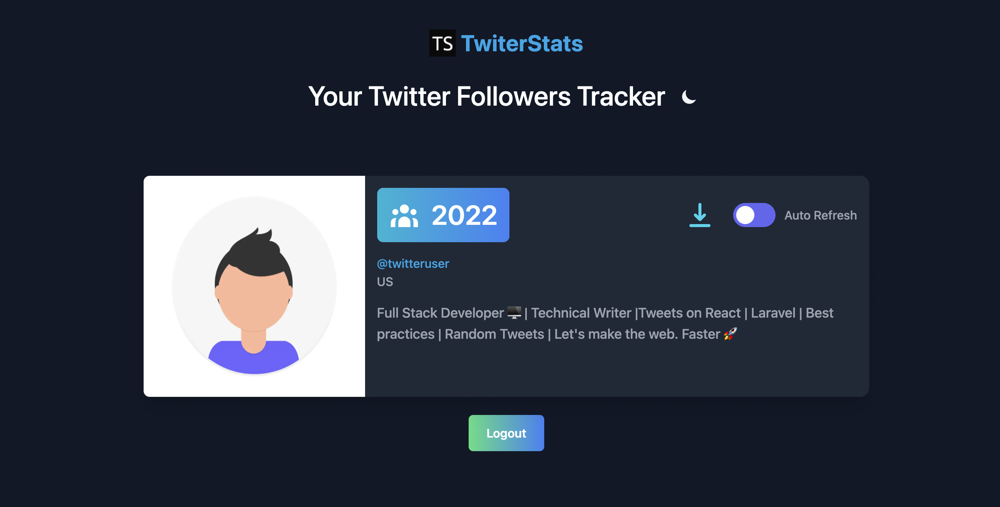

<p align="center"><a href="https://twiter-stats.vercel.app" target="_blank"></a></p>

<h1 align="center">TwiterStats✨️</h1>

<p align="center"></p>

<p align="center">
    <a href="https://twiter-stats.vercel.app" target="_blank">View Demo</a>
    ·
    <a href="https://github.com/Nilanth/twiter-stats/issues/new/choose">Report Bug</a>
    ·
    <a href="https://github.com/Nilanth/twiter-stats/issues/new/choose">Request Feature</a>
</p>


## TwiterStats

TwiterStats is a Twitter Followers Tracker with some cool features.

## 🚀 Demo

<a href="https://twiter-stats.vercel.app" target="blank">

</a>

Try the App: [TwiterStats](https://twiter-stats.vercel.app)

## Features

- Real time followers count
- Export the profile card as image
- Dark Mode Support
- Much more coming soon

## Quick Start

## 🛠️ Installation Steps

1. Clone the repository

```bash
https://github.com/Nilanth/twiter-stats.git
```

2. Change the working directory

```bash
cd twiter-stats
```

3. Install dependencies

```bash
yarn install
```

4. Create `.env` file in root and add your variables

```bash
TWITTER_ID=
TWITTER_SECRET=
NEXTAUTH_URL=http://localhost:3000
NEXTAUTH_SECRET=
NEXT_PUBLIC_ANALYTICS_ID=
```

5. Run the app

```bash
yarn run dev
```

You are all set! Open [localhost:3000](http://localhost:3000/) to see the app.

## 💻 Built with

- [Next JS](https://nextjs.org/)
- [NextAuth](https://next-auth.js.org): Authentication for Next.js
- [Tailwind](https://tailwindcss.com/): for UI
- [SWR](https://swr.vercel.app/): React Hooks for Data Fetching
- [html-to-image](https://github.com/bubkoo/html-to-image): Generates an image from a DOM node using HTML5 canvas and SVG
- [heroicons/react](https://heroicons.com/): for icons
- [twitter-lite](https://github.com/draftbit/twitter-lite): A server library for the Twitter API
- [next-themes](https://github.com/pacocoursey/next-themes): Dark Mode Support
- [vanilla-tilt](https://micku7zu.github.io/vanilla-tilt.js/): 3D tilt
- [Vercel](http://vercel.com/): for hosting

## Contributing

Please see [CONTRIBUTING](.github/CONTRIBUTING.md) for details.

## Security Vulnerabilities

Please review [our security policy](../../security/policy) on how to report security vulnerabilities.

## Credits

-   [Nilanth](https://github.com/nilanth)
-   [All Contributors](../../contributors)

## License

The MIT License (MIT). Please see [License File](LICENSE.md) for more information.

## 🦄 Deploy

<a href="https://vercel.com/new/clone?repository-url=https%3A%2F%2Fgithub.com%2FNilanth%2Ftwiter-stats">
</a>
<a href="https://app.netlify.com/start/deploy?repository=https://github.com/Nilanth/twiter-stats">

</a>
<a href="https://cloud.digitalocean.com/apps/new?repo=https://github.com/Nilanth/twiter-stats">

</a>

## Support

This project needs a ⭐️ from you. Don't forget to leave a star ⭐️

If you found TwiterStats helpful, consider supporting me with a coffee.

<a href="https://www.buymeacoffee.com/nilanth" target="_blank"></a>

